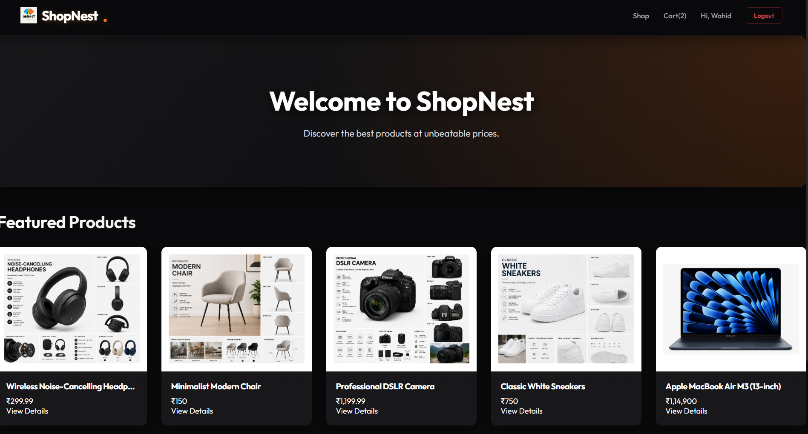
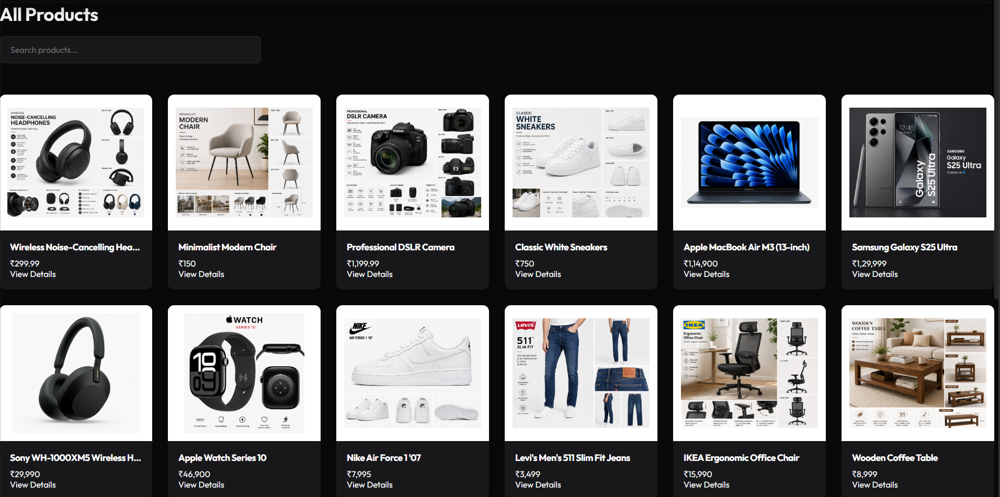
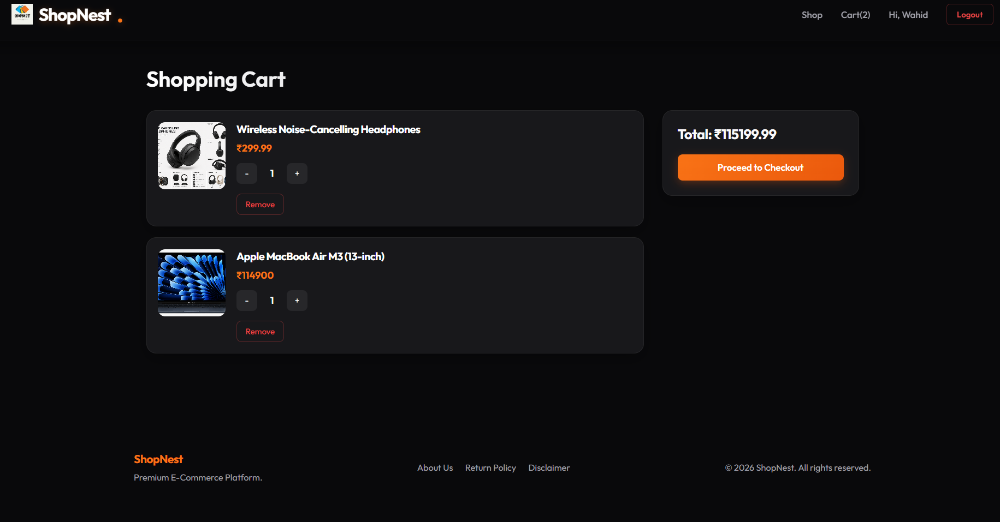

# 🛍️ ShopNest

<p align="center">
  
  
  
  
  
</p>

A modern **Full Stack MERN E-Commerce Web Application** that allows users to browse products, manage their cart, securely authenticate, place orders, and make online payments using **Razorpay**.

## 🚀 Live Demo

🔗 **https://shopnest-en74.onrender.com**

---

## 📸 Preview

> Add screenshots of your project here.

### 🏠 Home Page



### 🛍️ Products Page



### 🛒 Shopping Cart



---

# ✨ Features

- 🔐 JWT Authentication
- 👤 User Registration & Login
- 🛒 Shopping Cart
- ❤️ Responsive UI
- 📦 Product Listing
- 🔍 Product Details
- 💳 Razorpay Payment Integration
- 📋 Order Management
- 📊 Admin Analytics
- ☁️ MongoDB Atlas Database
- 🚀 Fully Deployed on Render

---

# 🛠 Tech Stack

## Frontend

- React.js
- React Router DOM
- CSS3
- Fetch API

## Backend

- Node.js
- Express.js
- JWT Authentication
- Bcrypt
- Razorpay
- Mongoose

## Database

- MongoDB Atlas

## Deployment

- Render

---

# 📂 Project Structure

```
ShopNest
│
├── frontend
│   ├── src
│   ├── public
│   └── package.json
│
├── Backend
│   ├── config
│   ├── controllers
│   ├── middleware
│   ├── models
│   ├── routes
│   ├── index.js
│   └── package.json
│
├── package.json
└── README.md
```

---

# ⚙️ Installation

## Clone Repository

```bash
git clone https://github.com/abdulwahid0173/ShopNest.git

cd ShopNest
```

---

## Install Dependencies

```bash
npm run install-all
```

or manually

```bash
cd Backend
npm install

cd ../frontend
npm install
```

---

## Environment Variables

Create a `.env` file inside the **Backend** folder.

```env
MONGO_URI=your_mongodb_connection_string

JWT_SECRET=your_jwt_secret

RAZORPAY_KEY_ID=your_key

RAZORPAY_KEY_SECRET=your_secret

FRONTEND_URL=http://localhost:3000

NODE_ENV=development
```

---

# ▶️ Run Locally

Start Backend

```bash
cd Backend

npm run dev
```

Start Frontend

```bash
cd frontend

npm start
```

---

# 🌐 API Endpoints

## Authentication

```
POST /api/auth/register

POST /api/auth/login

GET /api/auth/profile
```

## Products

```
GET /api/products

GET /api/products/:id
```

## Orders

```
POST /api/orders

GET /api/orders
```

## Payments

```
POST /api/payments/create-order

POST /api/payments/verify
```

---

# 🚀 Deployment

Frontend and Backend are deployed together on **Render**.

Live Project

**https://shopnest-en74.onrender.com**

---

# 📌 Future Improvements

- Wishlist
- Product Search
- Filters
- Product Reviews
- Email Notifications
- Admin Dashboard Improvements
- Coupon System
- Inventory Management

---

# 👨‍💻 Author

**Abdul Wahid**

GitHub

https://github.com/abdulwahid0173

LinkedIn

https://www.linkedin.com/in/abdulwahid0173/

---

# ⭐ Support

If you like this project, don't forget to **Star ⭐ the repository**.

It motivates me to build more awesome projects.

---

## 📜 License

This project is licensed under the MIT License.